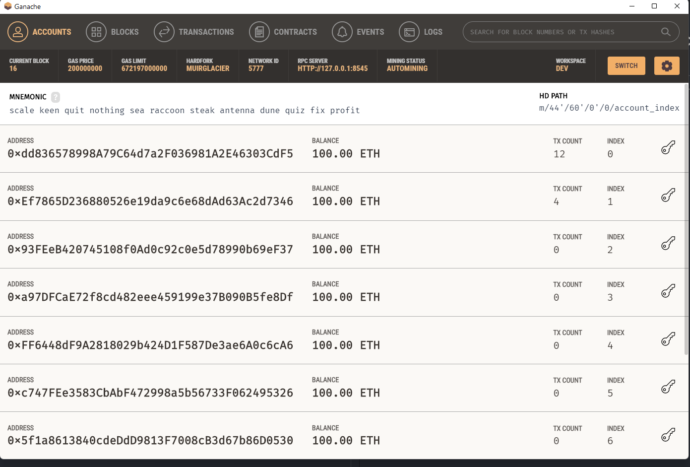
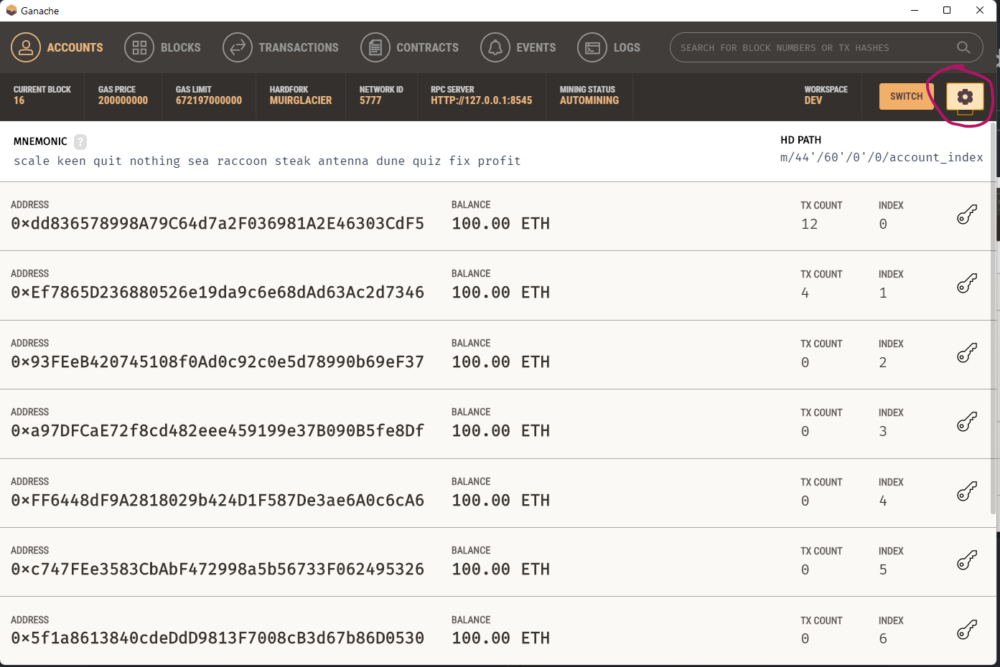
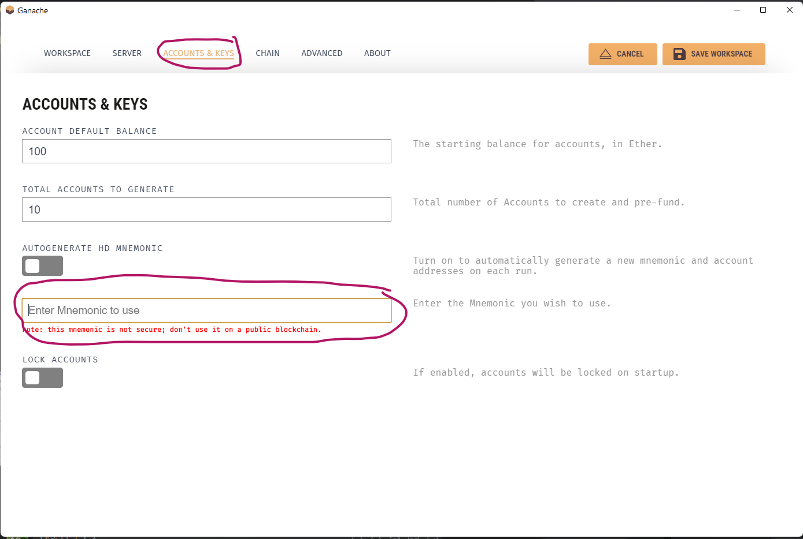
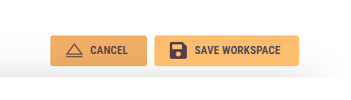
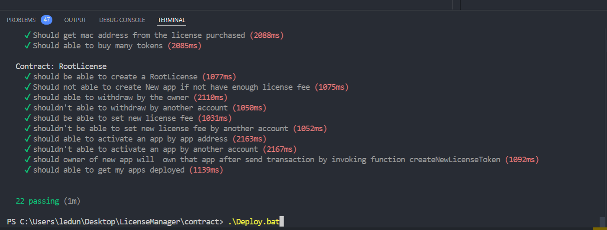

<strong><h1>Before deploy smart contract you must setup ganache as following steps</h1></strong>

<ul>
<li>
 Step 1: Download Ganache at <a href='https://trufflesuite.com/ganache'>Download Ganache</a>
</li>
<li>
  Step 2: Run Ganache
  
</li>
<li>
  Step 3: Click the setting button as the figure below
  
</li>
<li>
  Step 4: Fill in Mnemonic text field:
  <code>scale keen quit nothing sea raccoon steak antenna dune quiz fix profit</code>
  
</li>
<li>
  Step 5::
  
</li>

</ul>

<h1>How to deploy this smart contract to the ganache <h1>
<ul>
  <li> On the windows run command <code>.\Deploy.bat`</code> </li>
  
  <li>It will migrate all the contracts in folder migration and then copy the compiled contracts to three folders: 
  <ul>
  <li>
  <strong>web/src/contracts</strong>, 
  </li>
  <li>
  <strong>desktop/src/contracts</strong> 
  <li>
  <strong>venderjs/src/contracts</strong>
  </li>
  </ul>  
 </li>
</ul>

<h1>References</h1>
<ul>
<a src='https://github.com/niksauer/serverless-software-license'>Serverless Software License</a>  
</ul>
