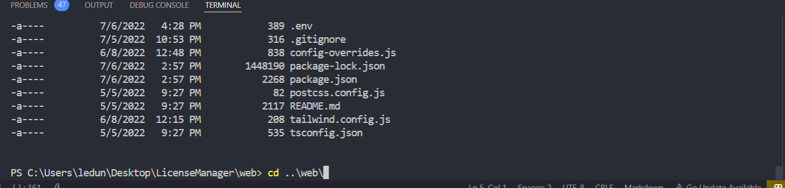
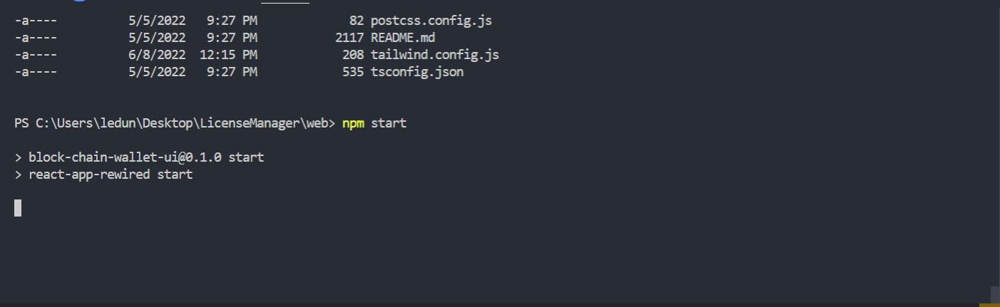
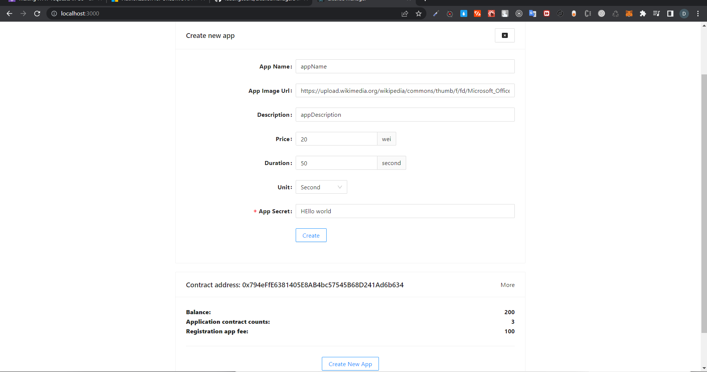
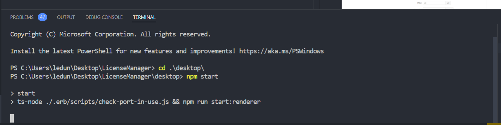
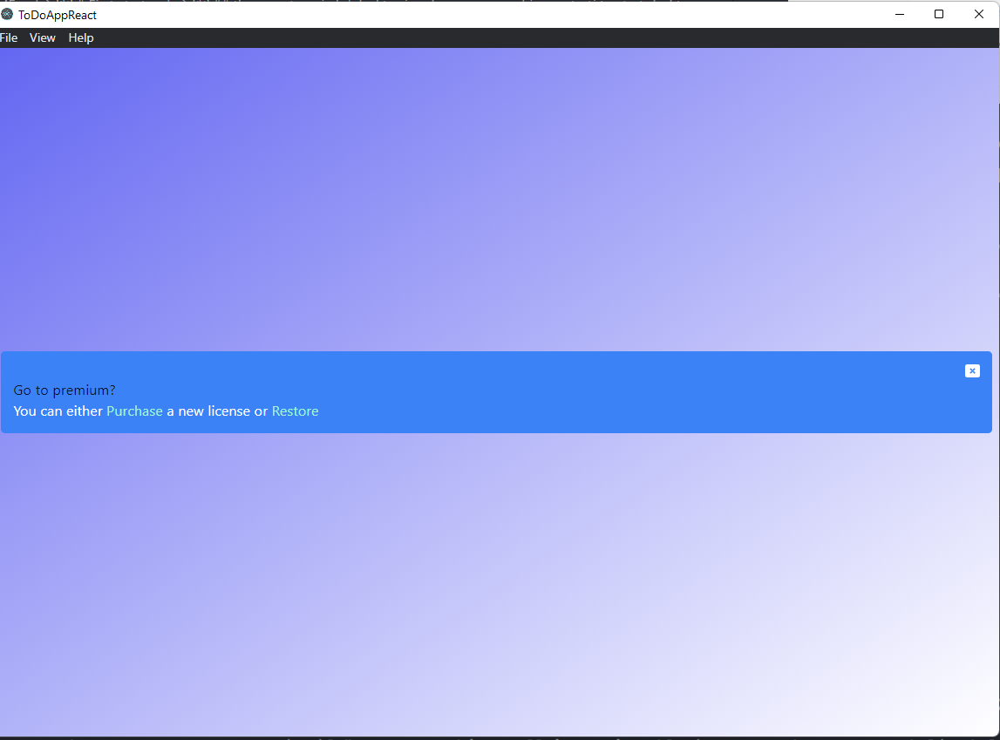
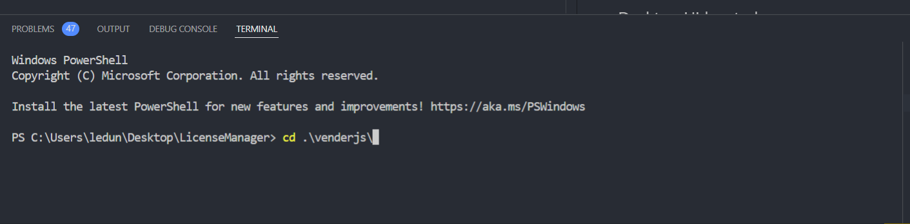
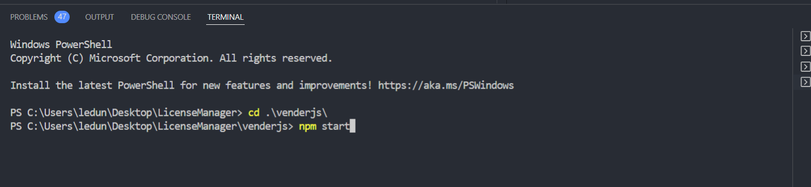
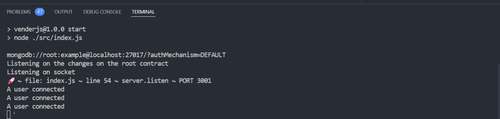

# After deploy smart contract on ganache tool follow

# !! Note that if npm command failed you should run `npm install` first to install nessesary libraries

# Follow few steps bellow to smart project

# First start web

## type command cd to folder `web`

## then run command `npm start` to run react web page

## The web UI booted up

## then run type `cd ..\desktop` and run command `npm start` to start desktop app

## Desktop UI booted

# Start up venderjs

## type command `docker-compose up` to start up mongodb for venderjs store secret key of the app (sensitive information should not store on blockchain [Vulnability to store sensitive data on blockchain](https://studygroup.moralis.io/t/how-to-read-private-variables/38777)

## If the command failed you should create folder data on the current folder to `docker-compose` create mongodb container and persist data on that folder

## Then run npm start to boot up venderjs

# Venderjs booted

Link video setup and run application
[Video Setup app](https://www.youtube.com/watch?v=t1n_YJIi4KM)
